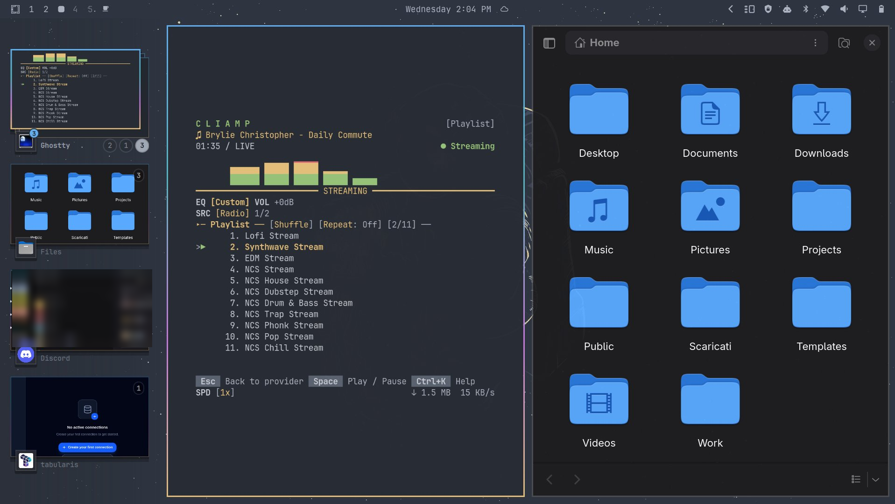

# OmaStage

An Omarchy Shell plugin that turns the left edge of the focused monitor into a compact, macOS-inspired Stage Manager holding background Hyprland windows. Features dynamic aspect-ratio cards, true multi-effect rounded corner masking, hardware-accelerated translucent blur, and per-app stacked cards.



## Features

- **Live Window Thumbnails**: High-performance screencopy previews via `hyprland-toplevel-export-v1`.
- **Dynamic Aspect Ratio**: Cards naturally match the proportion of each window without black letterboxing bars.
- **Hardware Blur & Glassmorphic Backdrop**: Clean translucent blurred background integrating with Hyprland's layer effects.
- **Application Grouping & 3D Stacks**: Windows of the same app are grouped into stacked cards with workspace badges.
- **MRU Ordering & Stability**: Most recently used order with *freeze-on-open* stability so cards never shift under your cursor.
- **macOS-faithful Stage**: The currently active window remains on stage, showing only background applications in the sidebar.
- **Mouse Wheel Stacks**: Smoothly scroll over stacked cards to cycle through window instances.
- **Full Keyboard Navigation**: Navigate and switch stages with standard keys.

## Keyboard Shortcuts

Inside the OmaStage overlay:

| Key | Action |
|---|---|
| `↑` / `↓` or `Tab` / `Shift+Tab` | Navigate between application groups |
| `←` / `→` | Cycle through windows inside the current stacked group |
| `Enter` / `Space` | Focus selected window |
| `Esc` | Close OmaStage |

## Local Installation via Symlink

```bash
git clone https://github.com/jvlianodorneles/omastage ~/Projects/omastage
cd ~/Projects/omastage
./install.sh
```

The script:

1. validates the manifest;
2. creates `~/.config/omarchy/plugins/dorneles.omastage` as a symlink to the repository;
3. enables the widget in the right section of the bar;
4. adds `CTRL+TAB` to `~/.config/hypr/bindings.lua`;
5. registers Hyprland layer blur rules for `omastage`;
6. reloads and validates Hyprland;
7. restarts Omarchy Shell so both plugin entry points are mounted.

## Usage

- Press `CTRL+TAB` anywhere in Hyprland;
- Or left-click the OmaStage icon in the top bar;
- Click any preview or badge to instantly activate that window;
- Scroll your mouse wheel over any stacked group to flip through its windows;
- Click outside the panel or press `Esc` to dismiss.

## Uninstall

```bash
./uninstall.sh
```

## License

MIT — see [LICENSE](LICENSE).
